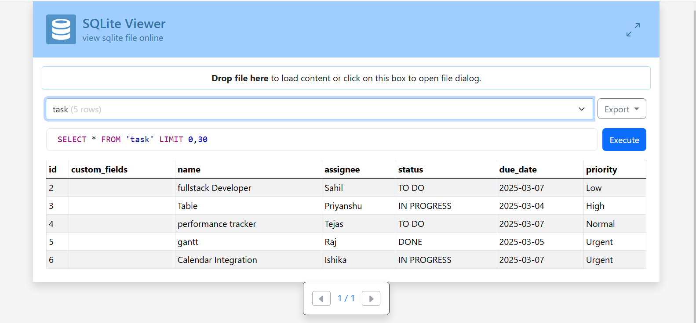

## Step 1. :-
The project aim is to schedule tasks for a specific date and time and store it in database.where user can add his task and can assign  priority and it will save in db as table. In this application i use sqlalchemy to store the data and js for frontend.If user want to create extra column then he can create so this change will reflect in database also.(Completed)

## Step 2. :-
This Data we will handover to agent and agent will schdule the task using deadline,Priority score and urgency.(Working)

## Step 3. :-
Agent will get the task and will integrate in google calendar to give reminder to user about task according to the priority and deadline.(soon)

## Step 4. :-
Agent will get the task threw gmail's mail and will integrate in google calendar to give reminder to user about task according to the priority and deadline.(soon)

## Step 5. :-  
we will try to implement Performance manager where employees's team  can assign task,deadline, priority,Time spent,Project Status and we can track their performance.(soon)

## Step 6. :-
we will try to implement Time tracking where employees can track their time spent on task.(soon)

# Data on Onlin sqlite viewer

## Start Application after clone
'''
pip install -r requirements.txt

'''

### Create Database

'''
python init_db.py
'''
### Update or create Migration

'''
flask db init
'''

'''
flask db upgrade
'''

## Run application

'''
flask run 
'''